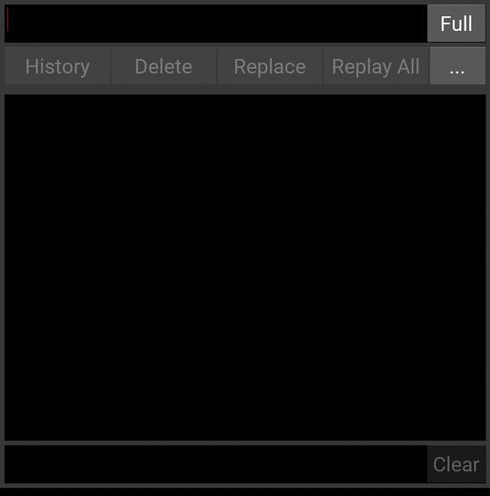
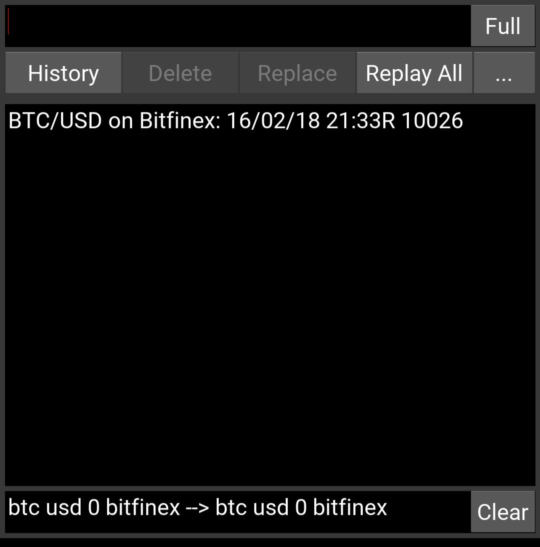
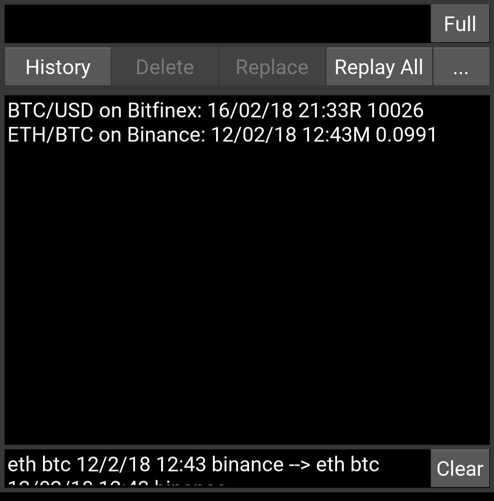
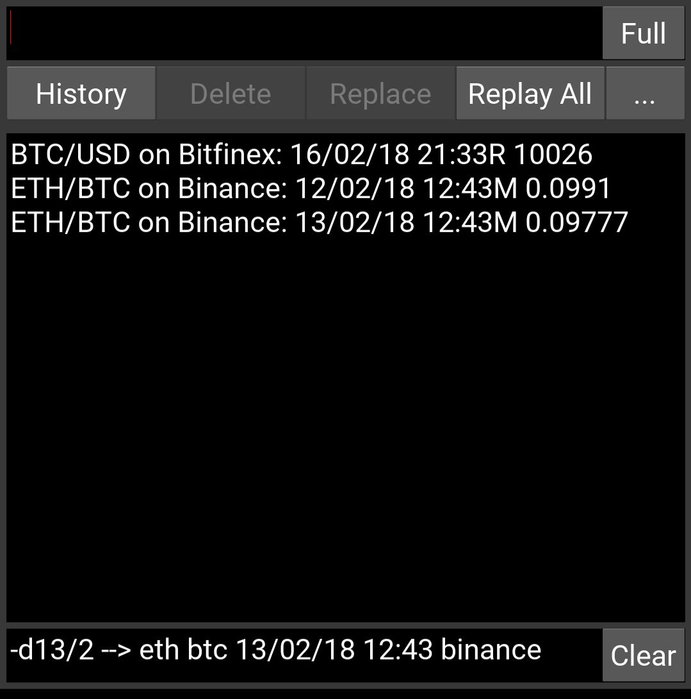
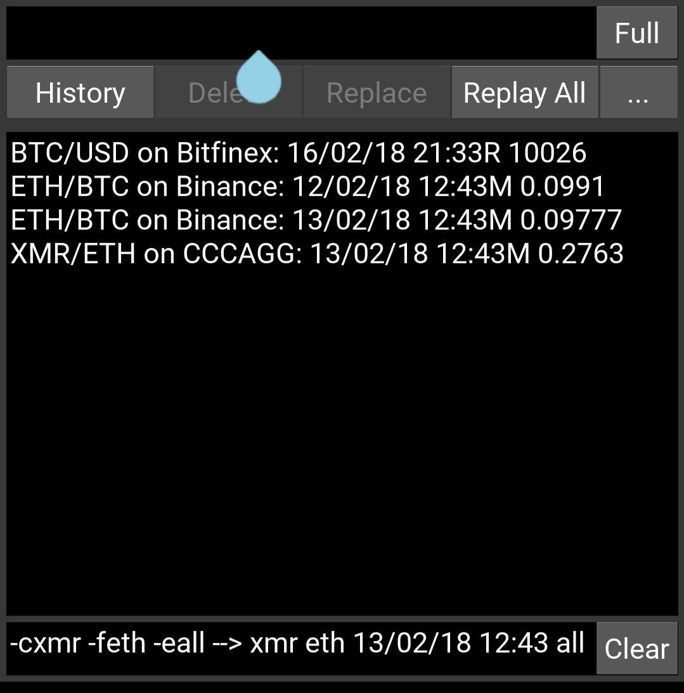
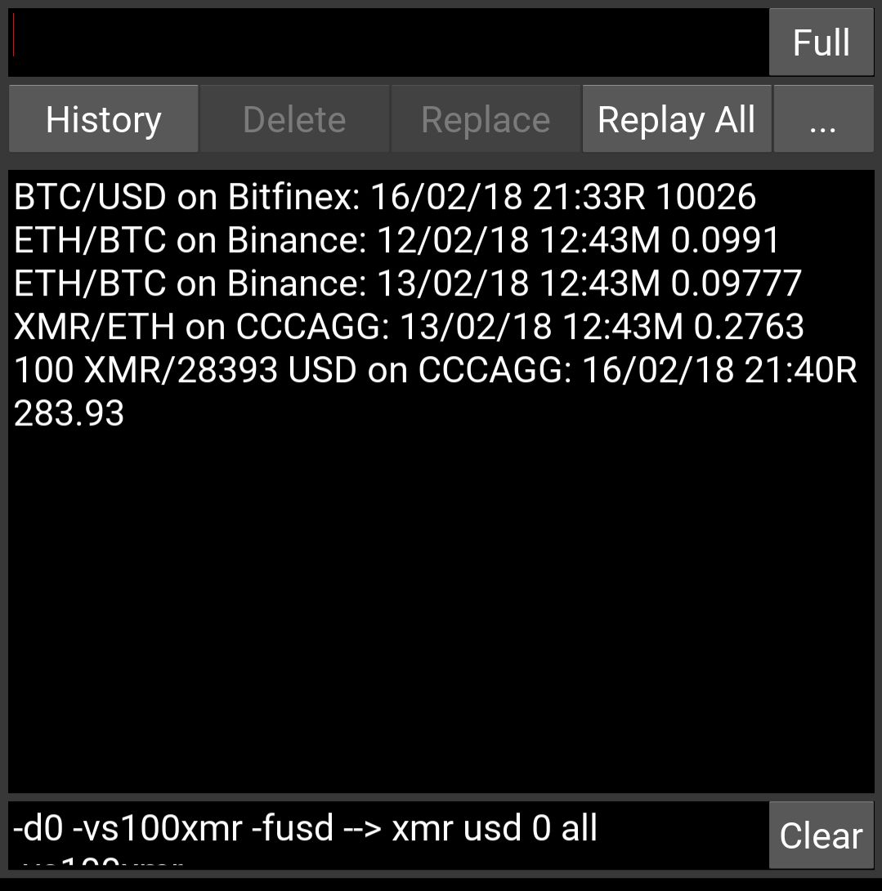
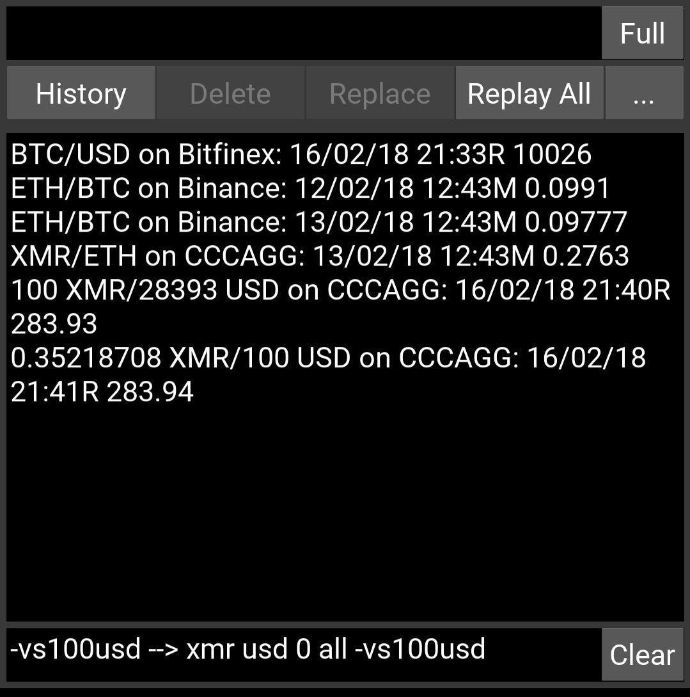
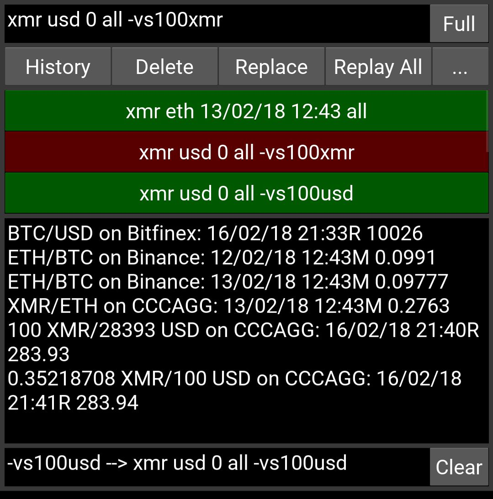

# CryptoPricer
RT and historical cryptocurrencies price requester.

## What does it do ?
CryptoPricer runs on your smartphone (Android, and, later, IPhone). It accepts user requests
and returns either real time or historical cryptocurrency rates. The prices are obtained not
directly from the exchanges, but from the [cryptocompare.com](http://cryptocompare.com) site which collects in 
real time price and volume information from more than 90 exchanges.

## Usage examples
### Requesting RT BTC/USD on Bitfinex
#### Full request: btc usd 0 bitfinex

Comment: 
* 0 means real time
* the request is displayed in the status bar
* R after the price means real time

### Requesting historical price ETH/USD on Binance
#### Full request: eth usd 12/2/18 12:43 bitfinex

Comment: 
* M after the price means historical Minute price. On cryptocompare, historical prices are available at a minute resolution for the last 7 days. Older prices are day prices (followed by D).

### Changing only the date of the previous request
#### Partial request: -d13/2

Comment: 
* -d is the partial request command for setting only the date
* the status bar shows the modified full request

Other partial request commands
* -t --> time
* -c --> cryptocurrency
* -f --> fiat currency
* -e --> exchange

### Changing the crypto, the fiat and the exchange of the previous request
#### Partial request: -cxmr -feth -eall

Comment: 
* all means average of all exchanges (CCCAGG)

### Using the -v value command to obtain the counterparty value at the obtained price of the value command quantity of the crypto/fiat
#### Partial request: -d0 -vs100xmr -fusd to obtain the counterparty value of 100xmr in usd at the returned RT xmr price

Comment: 
* the s flag of -vS means the -vs command will be saved in the command history

### Using the -v value command to obtain the counterparty value at the obtained price of the value command quantity of the crypto/fiat
#### Partial request: -vs100usd to obtain the counterparty value of 100usd in xmr at the returned RT xmr price

### Displaying the request (full and partial) history list using the "History" button
#### 

Comment: 
* if a line is selected (shown in red here), it can be replayed, or deleted from the history or changed
* pressing the "Replay all" button replays all the requests in the history

### Saving the history request list into a file for further replay
#### Here, the "Full" button was first pressed to set the app in full screen mode. In partial mode, the room is left for the keyboard.

Comment: 
* in the save dialog, an option is available to automatically reload the saved file at app launch

