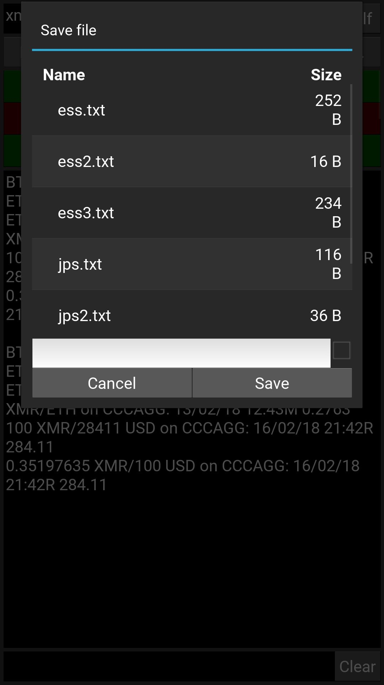
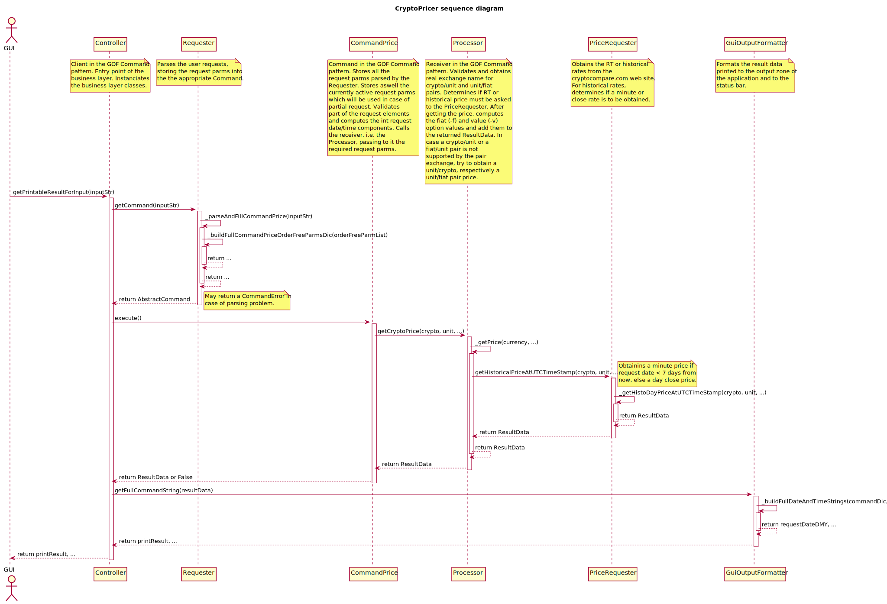

# CryptoPricer
RT and historical cryptocurrencies price requester.

## What does it do ?
CryptoPricer runs on your smartphone (Android, and, later, IPhone). It accepts user requests
and returns either real time or historical cryptocurrency rates. The prices are obtained not
directly from the exchanges, but from the [cryptocompare.com](http://cryptocompare.com) site which collects in 
real time price and volume information from more than 90 exchanges.

## CryptoPricer layout overview

## Usage examples
### Requesting RT BTC/USD on Bitfinex
#### Full request: btc usd 0 bitfinex

Comment: 
* 0 means real time
* the request is displayed in the status bar
* R after the time means real time
* the date and time displayed are local and account for winter/summer time. CryptoPricer accepts local date/time specifications and convert them to UTC before querying cryptocompare. The returned data date/time info is then converted back to local time.

### Requesting historical price ETH/USD on Binance
#### Full request: eth usd 12/2/18 12:43 bitfinex

Comment: 
* M after the time means historical Minute price. On cryptocompare, historical prices are available at a minute resolution for the last 7 days. Older prices are day prices (followed by D). A day price is the price at 23:59 UTC time.

### Changing only the date of the previous request
#### Partial request: -d13/2

Comment: 
* -d is the partial request command for setting only the date
* the status bar shows the modified full request

Other partial request commands
* -t --> time
* -c --> cryptocurrency
* -f --> unit currency
* -e --> exchange

### Changing the crypto, the unit and the exchange of the previous request
#### Partial request: -cxmr -feth -eall

Comment: 
* all for the exchange means average of all exchanges (CCCAGG)

### Using the -v value command to obtain the counterparty value in unit at the obtained price of the value command quantity of the cryptocurrency
#### Partial request: -d0 -vs100xmr -fusd to obtain the counterparty value in usd of 100 xmr, computed using the returned RT xmr price

Comment: 
* the s flag of -vS means the -vs command will be saved in the command history

### Using the -v value command to obtain the counterparty value in mryptocurrency at the obtained price of the value command quantity in unit
#### Partial request: -vs100usd to obtain the counterparty value of 100 usd in xmr at the returned RT xmr price

### Displaying the request (full and partial) history list using the "History" button
#### 

Comment: 
* if a line is selected (red line here), it can be replayed, or deleted from the history or modified and replaced in the history list
* pressing the "Replay all" button replays all the requests in the history

#### Here, the "Full" button was pressed to set the app in full screen mode. In partial mode, the room is left for the keyboard.

Comment: 
* the result of the "Replay all" button can be seen here with updated RT (21:42) request times
* pressing the "Clear" button erases all the input and output fields/zones

### Saving the history request list into a file for further replay

Comment: 
* in the save dialog, the option check box above the "save" button enables to automatically reload the saved file at app launch 
* saving and reloading a history list containing real time requests with -vs value commands offers a quick way to obtain the up-to-date value of the cryptocurrency positions hold in a portfolio

### Numerous great improvements to come
#### As is, CryptoPricer is pretty basic. Though, it has been developped with respect of a sound object oriented architecture and with a very strong emphasis on unit testing. This offers the warranty that
* the application can be extended easily
* adding or improving functionality won't introduce bugs in the existing code

## Installation
### Required libraries
* kivy 2.0
* arrow 1.2.1
* configobj 5.0.6
* bs4 0.0.1 (beautifulsoup4)
* pillow
  
### Required libraries for kivy 1.11
* kivy.deps.sdl2 (warning: SDL2 not SD12 !)
* kivy.deps.glew

## Implementation
### Typical usage sequence diagram
Here, a simple request returning an historical day price is performed. 

The request is 'btc usd 12/05 binance'

